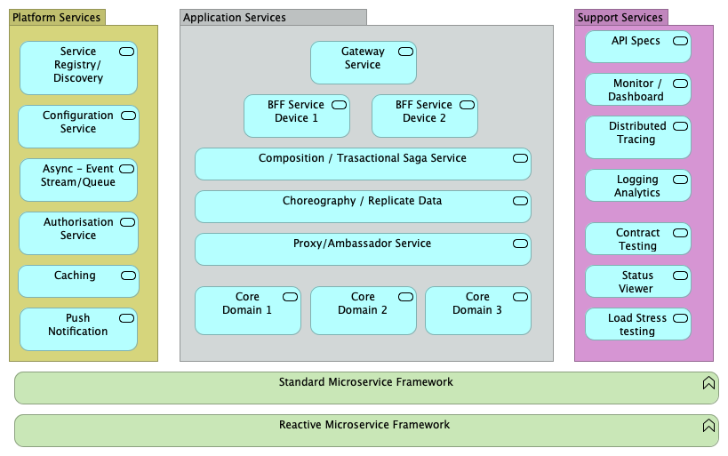

# Kim Horns Presentations

A small selection of my slides, presentations and templates. Some use animations and these are unfortunately lost in the PDFs.
These are historical and may not represent my views and beliefs today.

# Software Engineering Slide Packs:

-	Instituting CI/CD Architecture First - ***Architecture-CICD.pdf***
-	The 'complete' System/Solution Architecture Framework - The Cube - ***3D-Cube-Short New.pdf***
-	System Architecture Template (SAD) based on The Cube - ***SAD-Light Template V0.0.docx***
-	Architecture Views Approaches - ***Arch-Views.pptx***
-	Enterprise, Program, Solution Process Layers: ***EA Layers Of Architecture.pdf***
-	Architecture Principles Guidance : ***Principles-Guidance.pdf***
-	The 'complete' Requirements Framework, and old deck being renovated - ***Rqmts_V5.95.pdf*** 
-   Solution on a page (SOAP) template: ***SOAP-Template.pptx***
- 	Archimate Introduction ***Archimate.pdf***
-	Architecture Roles: ***Architect Roles General.docx***
-   Prototyping and Risk ***Protype-Risk.pdf***
-   Enterprise Architecture as Strategy, old deck: ***EA_6.7.pdf***
-   Agile Requirements ***Agile Rqmts.pdf***
-   Iterative Testing Approaches ***Iterative Testing-V1.7***
-   IT Governance ***Governance_V0.19.pdf***

# Systemic Qualities Guidance  - what are NFRs and Systemic Qualities 
Architure is manly defined by Non-Functional Qualities (requirements), and these
allow us to determine the quality of a solution System and Architecture.

-	NFRs are driven by business requirements and objectives ***NFRs Businesss Driven.pdf*** 
-	Introduction to NFRs and Quality: ***NFR Introduction.pdf***

# SDLC and Process, Estimation - Way of Working Material

The first pack below describes an up to date, Agile Way of Working. It is based on material from second item describing  a new 'radical' ways to look at SDLC, this is 'Essence'. It argues that Practices are better then process.   It also talks about SPEM which is a model of SDLCs. Eclipse has implemented a CAD Authoring tools for process, called Eclipse Process Framework (EPF), based on SPEM model, and two examples are provided. The tool provides a large amount of re-usable material so describing your own processes is quite easy.  Examples include a simple process for SCRUM, and another famous process called OpenUP. 
Also a pack summarising various approaches to software estimation.

-	Agile Way of Working: ***WayOfWorking-New.pdf***
-	Practice VS Process. Looks at SEMAT, Essense, and SPEM, EPF: ***PracticeVProcess.pdf***
-	A vision Document Template: ***Vision Document Template***
-	Estimation : ***Estimation-V0.5.pdf***
-   Essense Sliders - reviewing a project status ***EssenceSldiers.ppt***

# SAFe Material: 

-	SAFe-Architecture-New.pdf
-	SimpleSAFe-Intro.pdf
-	SAFe-Intro.pptx

# IT Strategy And Innovation

This material is based on Kaplan and Nortons Famous work on Corporate Strategy and Performance Management
-	Corporate Strategy approach (thats drills into IT Strategy) using Strategy Maps and balanced scorecard -  ***Strategy Approach.pdf***
-	The process for doing this strategy - ***Strategy Process.pdf***
-	The Innovation component of Strategy-  ***Innovation Process.pdf***
-   Building SaaS products - ***SaaS v1.0.pdf***

# Spark

- Spark introduction Short Course ( 1 week) - ***Spark-Intro.pdf***
The slides have a complete set of example code for Java.

# Microservices Presentation series

'"Microservice architecture" is a better term than "microservices". The latter suggests that a single microservice is somehow interesting.'
Chris Richardson  Oct 2016

Below is a series of Presentations on a Microservices Architecture Blueprint, all based on a Working Industrial Strength Real Applications.
the source code for these is available from me, on request ( to be put in GIT)
It is aimed at integrating a complex set of services that make up an application, and not individual 'micro services'.
The Blueprint is based on Spring Boot and Spring Cloud, Netflix Stack, Kafka, etc etc..
Sharing Data is an issue with microservies, the patterns and antipatterns are discussed, and how Data Mesh can help.

- MicroServices-E1-Intro.pdf
- MicroServices-E2-Strategy.pdf
- MicroServices-E3-Example.pdf
- MicroServices-E4-Example2.pdf
- MicroServices-E5-Example3.pdf
- MicroServices-E6-Example4.pdf
- MicroServices-E7-REST-Reliability.pdf
- Microservice-API-Mngt.pdf 
- Microservice-Sharing.pdf
- Microservice-Principles.pdf
- An old talk on SOA ***SOA_V0.35.pdf***

- A LEAN Canvas bases Microservice Template  - ***MOAP-Template.pptx***

# Microservice Principles

Microservices are:
1.	Modelled around a bounded context; the business domain.
2.	Responsible for a single capability;
3.	Individually deployable, based on a culture of automation and continuous delivery;
4.	The owner of its data;
5.	Consumer Driven;
6.	Not open for inspection;  Encapsulates and hides all its detail;
7.	Easily observed;
8.	Easily built, operated, managed and replaced by a small  autonomous team;
9.	A good citizen within their ecosystem;
10.	Based on Decentralisation and Isolation of failure;

